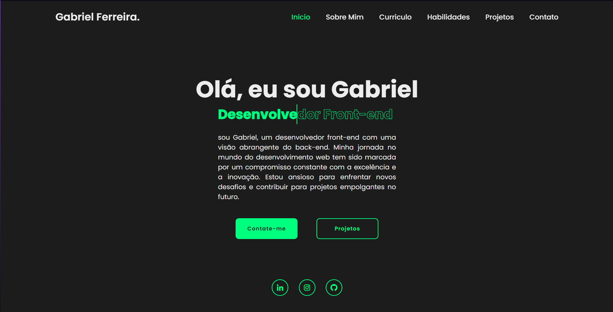

<h1 align="center"> Portifólio </h1>

 

  

## 🚀 Tecnologias

Esse projeto foi desenvolvido com as seguintes tecnologias:

- HTML e CSS
- JavaScript
- Git e Github

## 💻 Projeto

Para você conhecer me conhecer melhor

- [Acesse o projeto finalizado, online](https://github.com/GDefalt/Portifolio)

## :memo: Créditos

Feito por Gabriel Ferreira :wave: 
